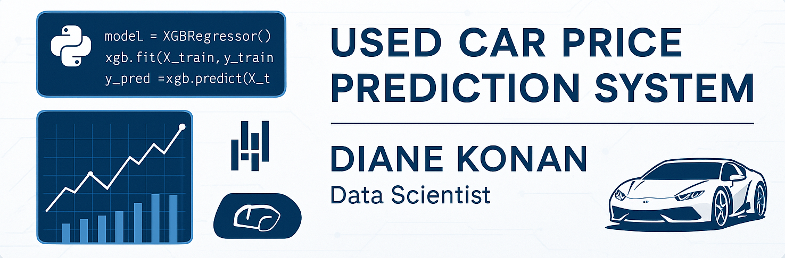

# Used Car Price Prediction System
ML-powered regression model predicting fair market prices of used vehicles to support data-driven pricing strategies in automotive retail.
 
**Tech Stack:** Python, Scikit-Learn, XGBoost, Pandas, NumPy, Matplotlib, REST API, AWS/Google Cloud  
**Goal:** Build a machine learning-powered pricing model to predict the fair market value of used cars and support data-driven pricing strategies.

---
##  Table of Contents

1. [Problem Statement](#-problem-statement)
2. [Data Source & Preprocessing](#data-source--preprocessing)
   - [Cleaning Techniques](#cleaning-techniques)
3. [Modeling & Evaluation](#modeling--evaluation)
   - [Approach](#approach)
   - [Algorithms Tested](#algorithms-tested)
   - [Tuning Strategy](#tuning-strategy)
   - [Evaluation Metrics](#evaluation-metrics)
   - [Top Performing Model](#-top-performing-model)
4. [Key Visualizations](#-key-visualizations)
5. [Deployment & Integration](#deployment--integration)
6. [Business Applications & Impact](#business-applications--impact)
7. [Link to Python Code](#link-to-python-code)

--- 

## 📍 Problem Statement

Manual pricing at car dealerships is often inconsistent and subjective, resulting in revenue loss through underpricing or inventory stagnation from overpricing.  
This project aimed to develop a machine learning system that accurately predicts the price of a used vehicle based on its specifications—ultimately improving pricing accuracy, competitiveness, and profitability.

---

## Data Source & Preprocessing

- **Source:** [Kaggle - Playground Series S4E9](https://www.kaggle.com/competitions/playground-series-s4e9/data)  
- **Size:** 188,534 records | 13 raw variables  
- **Challenges:**  
  - High cardinality (e.g., 1,897 unique car models)  
  - Corrupted characters in text fields  
  - ~21,000 missing values in key features like `fuel_type`, `clean_title`, and `accident_history`

### Cleaning Techniques
- Imputed `fuel_type` using brand heuristics (e.g., Tesla = electric) and keyword extraction from engine descriptors:
```python
# Fill Electric for Tesla/Rivian brands
df_cleaned['fuel_type'] = df_cleaned.apply(
    lambda row: 'Electric' if pd.isna(row['fuel_type']) and row['brand'] in electric_brands else row['fuel_type'],
    axis=1
)

# Keyword-based fuel type inference from engine description
def infer_fuel_type(row):
    ...
df_cleaned['fuel_type'] = df_cleaned.apply(infer_fuel_type, axis=1)
```
- Converted messy text fields into binary indicators (`transmission_binary`, `accident_flag`, etc.):
```python
# Transmission cleaned and encoded
# Step 1: Normalize transmission column (convert to lowercase for safety)
df_cleaned['transmission'] = df_cleaned['transmission'].astype(str).str.lower()

# Step 2: Standardize to 'manual' or 'automatic'
df_cleaned['transmission_type'] = df_cleaned['transmission'].apply(
    lambda x: 'manual' if x in ['manual', 'm/t'] else 'automatic'
)

# Step 3: Encode to binary: 1 = manual, 2 = automatic
df_cleaned['transmission_binary'] = df_cleaned['transmission_type'].map({
    'manual': 1,
    'automatic': 2
})

df_cleaned.drop('transmission_type', axis=1, inplace=True)
df_cleaned.drop('transmission', axis=1, inplace=True)

# Accident flag + title status
df_cleaned['accident_flag'] = df_cleaned['accident'].apply(
    lambda x: 1 if isinstance(x, str) and 'accident' in x.lower() else 0
)
df_cleaned['accident_info_provided'] = df_cleaned['accident'].notna().astype(int)

df_cleaned['clean_title_flag'] = df_cleaned['clean_title'].apply(
    lambda x: 0 if isinstance(x, str) and x.strip().lower() == 'yes' else 1
)
df_cleaned['title_info_provided'] = df_cleaned['clean_title'].notna().astype(int)

# Drop original text fields no longer needed
df_cleaned.drop(['accident', 'clean_title'], axis=1, inplace=True)
```
- Engineered informative features:
  - `car_age`, `mileage_per_year`, `engine_per_cylinder`
  ```python
  df_cleaned['car_age'] = current_year - df_cleaned['model_year']
  car_df['mileage_per_year'] = car_df['milage'] / (car_df['car_age'] + 1)
  car_df['engine_per_cylinder'] = car_df['engine_size'] / (car_df['cylinders'] + 1)
  ```
  - `brand_tier` and `model_tier` based on average price segments
  ```python
  # BRAND PRICE TIER 1-4
  df_cleaned['price_log'] = np.log(df_cleaned['price'])

  brand_avg_price = df_cleaned.groupby('brand')['price'].mean().sort_values(ascending=False).reset_index()

  brand_avg_price['brand_tier'] = pd.qcut(
    brand_avg_price['price'],
    q=[0, 0.35, 0.85, 0.95, 1.0],  # 35%, next 50%, next 10%, top 5%
    labels=[4, 3, 2, 1]  # 1 = Top 5%, 4 = Bottom 35%
  )

  brand_tier_map = dict(zip(brand_avg_price['brand'], brand_avg_price['brand_tier']))
  df_cleaned['brand_tier'] = df_cleaned['brand'].map(brand_tier_map)

  # MODEL PRICE TIER 1-3 
  model_avg_price = df_cleaned.groupby('model')['price'].mean()
  low_threshold = model_avg_price.quantile(0.25)
  high_threshold = model_avg_price.quantile(0.75)

  def encode_model_tier(model):
     avg_price = model_avg_price.get(model, 0)
     if avg_price <= low_threshold:
         return 3  # Low-end
     elif avg_price >= high_threshold:
         return 1  # High-end
     else:
         return 2  # Mid-range

  df_cleaned['model_tier'] = df_cleaned['model'].apply(encode_model_tier)
 
- Log-transformed the skewed target variable `price` to stabilize variance and reduce outlier impact:
 ```python
 df_cleaned['price_log'] = np.log(df_cleaned['price'])
 ```

➡️ **Final dataset:** 19 cleaned and enriched features

---

##  Modeling & Evaluation

###  Approach:
- Comparative model selection using **5-fold cross-validation** on the log-transformed price

###  Algorithms Tested:
- **Baseline Models:** Linear Regression, Ridge, Lasso  
- **Nonlinear Models:** K-Nearest Neighbors, Random Forest, Gradient Boosting, XGBoost  
- **Ensemble:** Stacked GB + XGBoost for improved generalization
```python
# All models to be tested
models = {
    "Linear Regression": LinearRegression(),
    "Ridge Regression": Ridge(alpha=1.0),
    "Lasso Regression": Lasso(alpha=0.01, max_iter=10000),
    "KNN Regressor": KNeighborsRegressor(n_neighbors=10),
    "Random Forest": RandomForestRegressor(
        n_estimators=100, max_depth=8, min_samples_split=5, max_features='sqrt', random_state=42
    ),
    "Gradient Boosting": GradientBoostingRegressor(
        n_estimators=100, learning_rate=0.03, max_depth=3, subsample=0.8, min_samples_split=5, random_state=42
    ),
    "XGBoost": XGBRegressor(
        n_estimators=100, learning_rate=0.03, max_depth=3, subsample=0.8, colsample_bytree=0.8,
        objective='reg:squarederror', random_state=42
    )
}

# Add Stacked Model (GB + XGB stacked together) to reduce RMSE
# Linear Regression used as meta-learner
base_learners = [
    ('gb', GradientBoostingRegressor(
        n_estimators=100, learning_rate=0.03, max_depth=3, subsample=0.8, min_samples_split=5, random_state=42)),
    ('xgb', XGBRegressor(
        n_estimators=100, learning_rate=0.03, max_depth=3, subsample=0.8, colsample_bytree=0.8,
        objective='reg:squarederror', random_state=42))
]

stacked_model = StackingRegressor(
    estimators=base_learners,
    final_estimator=LinearRegression(),
    n_jobs=-1
)


models["Stacked GB+XGB"] = stacked_model
```

###  Tuning Strategy:
- Conservative, domain-informed tuning to reduce overfitting  
  - E.g., `max_depth=3`, `learning_rate=0.03`, `subsample=0.8`

###  Evaluation Metrics:
- **R² (coefficient of determination):** Explained variance on log(price)
- **Log RMSE & MAE:** Predicted dollar accuracy

### 🏆 Top Performing Model:
> **Stacked Gradient Boosting + XGBoost**  
> Achieved **R² = 0.866**, outperforming all baselines

---

## 📈 Key Visualizations

- **Predicted vs. Actual Plot:** Stacked model closely tracks true prices across mid- and high-tier cars as shown by the points lying along the red dashed y = x line, which represents perfect prediction.


- **Residual Analysis:** No signs of heteroscedasticity or prediction bias. The stacked model is good for ensuring both low and high end cars are priced fairly, this is critical for maintaining competitiveness and profitability.
  
- **Feature Importance Charts:**  
  - Top drivers: `price_segment`, `car_age`, `mileage`, `model_tier`
  

---

## Deployment & Integration

- Deployed via **REST API** with a user-friendly input form
- Real-time prediction enabled through **AWS/Google Cloud**
- Included a monitoring & retraining plan to handle model drift using feedback loops and new data

---

## Business Applications & Impact

This predictive pricing system goes beyond academic modeling by delivering direct business value across multiple operational functions in the automotive resale market:

### Identify Undervalued Vehicles for Acquisition:
By comparing predicted market value to current listed prices, dealerships can spot bargains in real time, enabling smarter purchasing decisions that improve profit margins.

### Optimize Resale Prices to Maximize Turnover:
The model helps dynamically set competitive and data-backed selling prices, reducing inventory stagnation and accelerating vehicle turnover, which directly enhances revenue flow and reduces carrying costs.

### Price Rare or Unusual Cars with Confidence:
Traditional pricing methods often fail for low-frequency models. Our model’s high R² score (~87%) ensures reliable valuation even for rare vehicles, expanding inventory diversity without pricing risk.

### Enable Data-Driven Decision Making:
With nearly 87% of the price variance explained, dealership managers can move away from subjective estimation toward consistent, explainable, and data-validated pricing strategies.

### Future Integration Potential:
The modular nature of the model allows for easy deployment into existing inventory management systems and can support what-if pricing scenarios for sales strategy planning.

---
## Link to Python Code
Full Jupyter Notebook Code [here](UsedCarPricePred_Formatted.ipynb)
